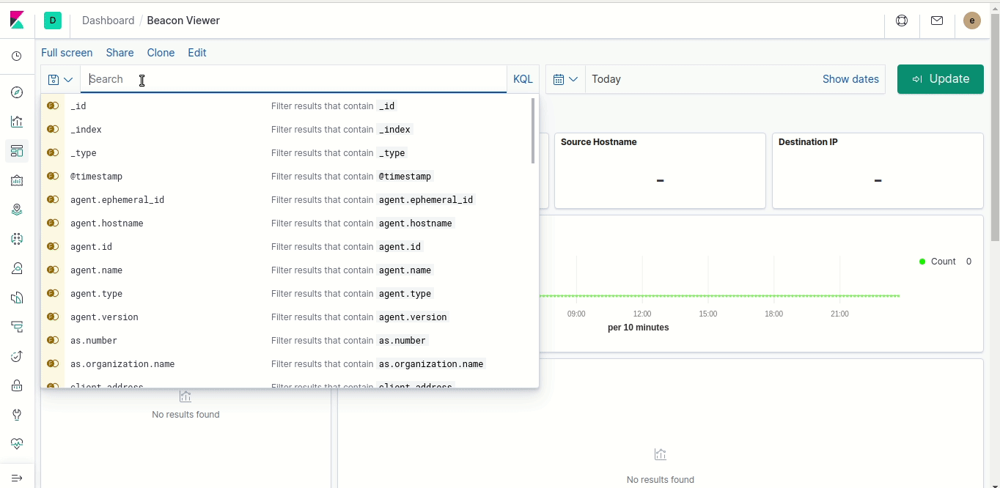

# BeaKer - Beaconing Kibana Executable Report

BeaKer visualizes Microsoft Sysmon network data to help threat hunters track down the source of suspicious connections. The custom dashboard presents which executables created a connection between two IPs, how many times they've connected, the protocol and ports used, and much more.

## Installation

Download the latest release tar file, extract it, and run `./install_beaker.sh` on the Linux machine that will aggregate your Sysmon data and host Kibana.

Then, on each Windows host you want to monitor, run the PowerShell script at `./agent/install-sysmon-beats.ps1`.

## Quick Start

After Sysmon starts sending data to ElasticSearch, Kibana will be ready to go. Filter by a source and destination IP and a time range to view what connections have been made between the two. The Program List will display which executables on the source machine made the connections to the destination. The actual Sysmon logs are displayed lower on the screen where you can investigate the events in greater detail.

## How it works

Sysmon -> Winlogbeats -> Elasticsearch -> Kibana -> Custom Dashboard

### Data Collected By Sysmon Per Network Connection
- Source
  - IP Address
  - Hostname
  - Port
- Destination
  - IP Address
  - Hostname
  - Port
- Network
  - Transport Protocol
  - Application Protocol
  - Community ID
- Process
  - PID
  - Executable
  - Entity ID
- User
  - Domain
  - Name
- Timestamp